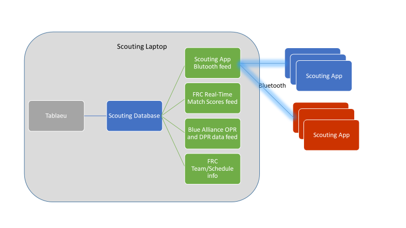

# 2017 SteamWorks Scouting App by CyberKnights FRC 4911

The high-level architecture for the Scouting system:  

* Andriod Scouting Apps collect data and push data to Scouting Laptop over Bluetooth in JSON.
* Scouting laptop (Windows) receives data and updates the local database after each match.
* Tableau connects to local database for match updates and slices and dices the data.

In addition, we're looking to preload the data base with Team/Schedule (potentially the android apps as well) and other info form FRC as well as in real-time collect the FRC Match Scores and Blue Alliance OPR/DPR data.  This may require tethering to a phone if WiFi connection ot internet isn't accessible or walking out to an area where it is. 

